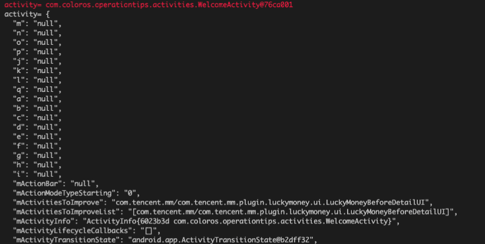

# `Describe.frida`

## why?

while hacking with frida, as is often the case that we want to introspect a hook params or return value,
`Describe.frida` empowers you to get more meaningful information about an object rather than `[Object object]` or `android.app.ContextImpl@f363a64`
just like below


## how?

```typescript
import { prettyprint } from './Describe'

...
ContextWrapper.attachBaseContext.implementation = function(...args) {
  console.log(JSON.stringify(prettyprint(args, 4, 2)))
  return this.attachBaseContext(...args)
}
...

```

opt-in `depth` (which affects field member expansion limit) and `hierarchyLimit` (which affects hierarchy tree expansion threshold) to leverage noisy & effects

`Describe.frida` does not handle circularly reference, but limited `depth` and `hierarchyLimit` will take care of this
